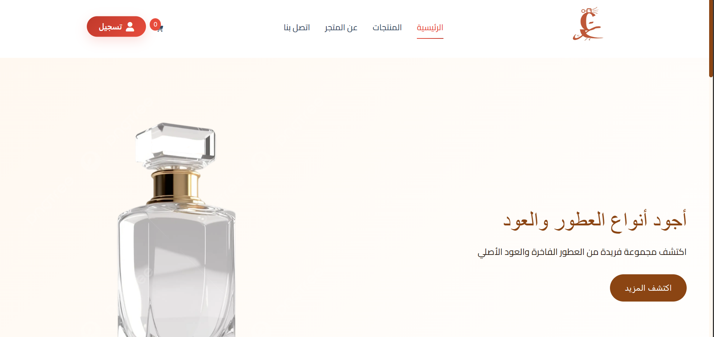

# Ezz E-Commerce API Backend 🚀

<div align="center">
  
  
  
  
</div>

## 📋 نظرة عامة

Ezz API هو الخادم الخلفي لمنصة التجارة الإلكترونية Ezz، مبني بـ ASP.NET Core 8.0. يوفر APIs شاملة لإدارة المنتجات، المستخدمين، الطلبات، والمدفوعات مع نظام أمان متقدم.



## 🎥 فيديو توضيحي

<!-- أضف رابط الفيديو هنا -->
[شاهد الفيديو على Google Drive](https://drive.google.com/drive/folders/1xfyJjqauAKvKS2ohfz2D75_HnJjYiM_O)

*أو يمكنك إضافة الفيديو مباشرة:*

```html
<video width="100%" controls>
  <source src="path/to/your/api-demo-video.mp4" type="video/mp4">
  متصفحك لا يدعم عرض الفيديو.
</video>
```

## ✨ الميزات الرئيسية

### 🔐 المصادقة والتفويض
- **JWT Authentication**: نظام مصادقة آمن
- **Google OAuth**: تسجيل الدخول بـ Google
- **Role-based Authorization**: أدوار المستخدمين (Admin, User)
- **Email Confirmation**: تأكيد البريد الإلكتروني

### 💳 معالجة المدفوعات
- **Stripe Integration**: دفع آمن بالبطاقات الائتمانية
- **WhatsApp Checkout**: خيار الدفع عبر WhatsApp
- **Payment History**: تاريخ المدفوعات
- **Order Tracking**: تتبع حالة الطلبات

### 📦 إدارة المنتجات
- **CRUD Operations**: إنشاء، قراءة، تحديث، حذف المنتجات
- **Categories Management**: إدارة فئات المنتجات
- **Image Upload**: رفع صور المنتجات
- **Inventory Tracking**: تتبع المخزون

### 📧 الاتصالات
- **Email Service**: إرسال الإيميلات باستخدام MailKit
- **Contact Forms**: نماذج التواصل
- **Notifications**: نظام الإشعارات

## 🛠️ التقنيات المستخدمة

| التقنية | الإصدار | الوصف |
|---------|---------|--------|
| **ASP.NET Core** | 8.0 | إطار العمل الأساسي |
| **C#** | 12.0 | لغة البرمجة |
| **Entity Framework Core** | 8.0.4 | ORM لقاعدة البيانات |
| **SQLite** | - | قاعدة البيانات |
| **JWT Bearer** | 8.0.4 | المصادقة |
| **Stripe.NET** | 43.20.0 | معالجة المدفوعات |
| **MailKit** | 4.12.1 | إرسال الإيميلات |
| **Swagger** | 6.6.2 | توثيق الـ API |

## 🚀 البدء السريع

### المتطلبات الأساسية

- .NET 8.0 SDK
- Visual Studio 2022 أو VS Code
- SQLite

### التثبيت والإعداد

1. **استنساخ المشروع**
   ```bash
   git clone <repository-url>
   cd Ezz-api
   ```

2. **استعادة الحزم**
   ```bash
   dotnet restore
   ```

3. **إعداد قاعدة البيانات**
   ```bash
   cd Ezz-api
   dotnet ef database update
   ```

4. **تشغيل التطبيق**
   ```bash
   dotnet run
   ```

5. **الوصول للـ API**
   
   افتح المتصفح وانتقل إلى:
   - API: `https://localhost:5001`
   - Swagger UI: `https://localhost:5001/swagger`

## 📁 هيكل المشروع

```
Ezz-api/
├── Controllers/              # تحكمات الـ API
│   ├── AuthController.cs     # المصادقة
│   ├── ProductsController.cs # المنتجات
│   ├── OrdersController.cs   # الطلبات
│   ├── PaymentsController.cs # المدفوعات
│   └── ContactController.cs  # التواصل
├── Data/                     # سياق قاعدة البيانات
│   └── ApplicationDbContext.cs
├── Models/                   # نماذج البيانات
│   ├── User.cs
│   ├── Product.cs
│   ├── Order.cs
│   └── Payment.cs
├── DTOs/                     # كائنات نقل البيانات
├── Services/                 # الخدمات
│   ├── EmailService.cs
│   ├── PaymentService.cs
│   └── TokenService.cs
├── Migrations/               # هجرات قاعدة البيانات
├── wwwroot/                  # الملفات الثابتة
├── appsettings.json         # إعدادات التطبيق
└── Program.cs               # نقطة البداية
```

## 🔧 إعداد التطبيق

### ملف appsettings.json

```json
{
  "ConnectionStrings": {
    "DefaultConnection": "Data Source=EzzStore.db"
  },
  "JwtSettings": {
    "SecretKey": "your-secret-key",
    "Issuer": "EzzAPI",
    "Audience": "EzzClient",
    "ExpiryMinutes": 60
  },
  "Stripe": {
    "PublishableKey": "pk_test_...",
    "SecretKey": "sk_test_..."
  },
  "Google": {
    "ClientId": "your-google-client-id",
    "ClientSecret": "your-google-client-secret"
  },
  "EmailSettings": {
    "SmtpServer": "smtp.gmail.com",
    "SmtpPort": 587,
    "SenderEmail": "your-email@gmail.com",
    "SenderPassword": "your-app-password"
  }
}
```

## 📚 API Endpoints

### 🔐 Authentication
```
POST   /api/auth/register          # تسجيل مستخدم جديد
POST   /api/auth/login             # تسجيل الدخول
POST   /api/auth/google-login      # تسجيل الدخول بـ Google
POST   /api/auth/refresh-token     # تجديد الرمز المميز
POST   /api/auth/logout            # تسجيل الخروج
```

### 📦 Products
```
GET    /api/products               # جلب جميع المنتجات
GET    /api/products/{id}          # جلب منتج محدد
POST   /api/products               # إضافة منتج جديد [Admin]
PUT    /api/products/{id}          # تحديث منتج [Admin]
DELETE /api/products/{id}          # حذف منتج [Admin]
```

### 🛒 Orders
```
GET    /api/orders                 # جلب طلبات المستخدم
GET    /api/orders/{id}            # جلب طلب محدد
POST   /api/orders                 # إنشاء طلب جديد
PUT    /api/orders/{id}/status     # تحديث حالة الطلب [Admin]
```

### 💳 Payments
```
POST   /api/payments/stripe        # معالجة دفع Stripe
POST   /api/payments/whatsapp      # معالجة دفع WhatsApp
GET    /api/payments/history       # تاريخ المدفوعات
```

### 📧 Contact
```
POST   /api/contact                # إرسال رسالة تواصل
```

## 🔒 الأمان

### JWT Configuration
```csharp
services.AddAuthentication(JwtBearerDefaults.AuthenticationScheme)
    .AddJwtBearer(options =>
    {
        options.TokenValidationParameters = new TokenValidationParameters
        {
            ValidateIssuer = true,
            ValidateAudience = true,
            ValidateLifetime = true,
            ValidateIssuerSigningKey = true,
            ValidIssuer = configuration["JwtSettings:Issuer"],
            ValidAudience = configuration["JwtSettings:Audience"],
            IssuerSigningKey = new SymmetricSecurityKey(
                Encoding.UTF8.GetBytes(configuration["JwtSettings:SecretKey"]))
        };
    });
```

### Authorization Policies
```csharp
services.AddAuthorization(options =>
{
    options.AddPolicy("AdminOnly", policy => 
        policy.RequireRole("Admin"));
    options.AddPolicy("UserOrAdmin", policy => 
        policy.RequireRole("User", "Admin"));
});
```

## 🗄️ قاعدة البيانات

### Entity Framework Migrations

```bash
# إنشاء migration جديد
dotnet ef migrations add MigrationName

# تطبيق migrations
dotnet ef database update

# إزالة آخر migration
dotnet ef migrations remove
```

### نماذج البيانات الرئيسية

```csharp
public class Product
{
    public int Id { get; set; }
    public string Name { get; set; }
    public string Description { get; set; }
    public decimal Price { get; set; }
    public int Stock { get; set; }
    public string ImageUrl { get; set; }
    public int CategoryId { get; set; }
    public Category Category { get; set; }
}

public class Order
{
    public int Id { get; set; }
    public string UserId { get; set; }
    public DateTime OrderDate { get; set; }
    public decimal TotalAmount { get; set; }
    public OrderStatus Status { get; set; }
    public List<OrderItem> OrderItems { get; set; }
}
```

## 🧪 الاختبارات

```bash
# تشغيل جميع الاختبارات
dotnet test

# تشغيل اختبارات مع التغطية
dotnet test --collect:"XPlat Code Coverage"

# تشغيل اختبارات محددة
dotnet test --filter "TestCategory=Unit"
```

## 📦 النشر

### Docker
```dockerfile
FROM mcr.microsoft.com/dotnet/aspnet:8.0 AS base
WORKDIR /app
EXPOSE 80
EXPOSE 443

FROM mcr.microsoft.com/dotnet/sdk:8.0 AS build
WORKDIR /src
COPY ["Ezz-api.csproj", "."]
RUN dotnet restore "./Ezz-api.csproj"
COPY . .
WORKDIR "/src/."
RUN dotnet build "Ezz-api.csproj" -c Release -o /app/build

FROM build AS publish
RUN dotnet publish "Ezz-api.csproj" -c Release -o /app/publish

FROM base AS final
WORKDIR /app
COPY --from=publish /app/publish .
ENTRYPOINT ["dotnet", "Ezz-api.dll"]
```

### IIS Deployment
```bash
dotnet publish -c Release -o ./publish
```

## 📊 المراقبة والسجلات

### Logging Configuration
```csharp
builder.Logging.ClearProviders();
builder.Logging.AddConsole();
builder.Logging.AddDebug();
builder.Logging.AddEventSourceLogger();
```

### Health Checks
```csharp
builder.Services.AddHealthChecks()
    .AddDbContextCheck<ApplicationDbContext>();

app.MapHealthChecks("/health");
```

## 🔧 أدوات التطوير

### Swagger Configuration
```csharp
builder.Services.AddSwaggerGen(c =>
{
    c.SwaggerDoc("v1", new OpenApiInfo 
    { 
        Title = "Ezz API", 
        Version = "v1" 
    });
    
    c.AddSecurityDefinition("Bearer", new OpenApiSecurityScheme
    {
        Description = "JWT Authorization header using the Bearer scheme.",
        Name = "Authorization",
        In = ParameterLocation.Header,
        Type = SecuritySchemeType.ApiKey,
        Scheme = "Bearer"
    });
});
```

## 🤝 المساهمة

1. Fork المشروع
2. إنشاء فرع للميزة الجديدة (`git checkout -b feature/AmazingFeature`)
3. Commit التغييرات (`git commit -m 'Add some AmazingFeature'`)
4. Push للفرع (`git push origin feature/AmazingFeature`)
5. فتح Pull Request

## 📋 قائمة المهام

- [ ] إضافة Redis للتخزين المؤقت
- [ ] تحسين أداء الاستعلامات
- [ ] إضافة المزيد من اختبارات الوحدة
- [ ] تحسين معالجة الأخطاء
- [ ] إضافة Rate Limiting
- [ ] تحسين الأمان

## 📄 الترخيص

هذا المشروع مرخص تحت رخصة MIT - راجع ملف [LICENSE](LICENSE) للتفاصيل.

## 📞 الدعم والتواصل

- 📧 البريد الإلكتروني: api-support@ezz.com
- 🐛 الإبلاغ عن الأخطاء: [GitHub Issues](https://github.com/your-repo/issues)
- 📖 التوثيق: [API Documentation](https://your-api-docs.com)
- 💬 المناقشات: [GitHub Discussions](https://github.com/your-repo/discussions)

## 📚 موارد إضافية

- [ASP.NET Core Documentation](https://docs.microsoft.com/en-us/aspnet/core/)
- [Entity Framework Core](https://docs.microsoft.com/en-us/ef/core/)
- [Stripe API Documentation](https://stripe.com/docs/api)
- [JWT.io](https://jwt.io/)
- [Swagger Documentation](https://swagger.io/docs/)

---

**تم تطوير هذا المشروع بـ ❤️ باستخدام ASP.NET Core**
